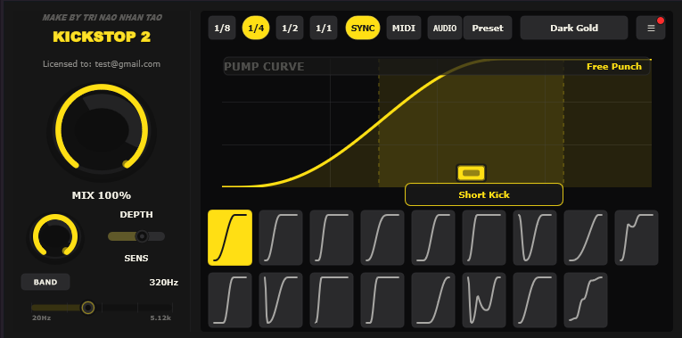

# Kickstop 2

Kickstop 2 is a Windows VST3 sidechain volume shaper made for fast, musical pump effects. It is designed for producers who want a clear kick-ducking workflow without setting up complicated routing every time.

[](https://github.com/dat514/KickStop2/releases/latest/download/installer.exe)



## Overview

Kickstop 2 shapes the volume of your audio with tempo-synced pump curves, MIDI triggers, or audio sidechain triggers. Use it to make bass, pads, leads, vocals, or full loops move around the kick with a clean, punchy ducking effect.

## Features

- VST3 effect for Windows DAWs.
- Host-synced pumping with `1/8`, `1/4`, `1/2`, and `1/1` timing.
- Trigger modes for `SYNC`, `MIDI`, and `AUDIO` sidechain workflows.
- Multiple pump curve presets plus a custom curve editor.
- `Mix` and `Depth` controls for subtle ducking or hard pumping.
- Band mode for frequency-focused ducking.
- Audio sensitivity control for external trigger signals.
- Preset import and export.
- Theme selection for different UI styles.

## Installation

1. Download the latest `installer.exe` from the button above.
2. Close your DAW before installing.
3. Run `installer.exe`.
4. Allow administrator permission when Windows asks.
5. The installer places the plugin here:

```text
C:\Program Files\Common Files\VST3\Kickstop 2.vst3
```

6. Open your DAW and rescan VST3 plugins if Kickstop 2 does not appear automatically.

## How To Run

1. Add `Kickstop 2` as an effect on the track you want to duck.
2. Start with `SYNC` mode for instant tempo-locked pumping.
3. Set `Mix` to `100%` and raise `Depth` until the movement is obvious.
4. Choose a curve preset that matches the groove.
5. Use `MIDI` mode if you want notes to trigger the ducking shape.
6. Use `AUDIO` mode if you want an external kick or sidechain signal to trigger the shape.
7. Enable `Band` when you only want part of the frequency range to duck.

## Notes

Kickstop 2 is an original plugin by Tri Nao Nhan Tao. It is built around the familiar sidechain volume-shaping workflow, with its own interface, controls, themes, and DSP implementation.
